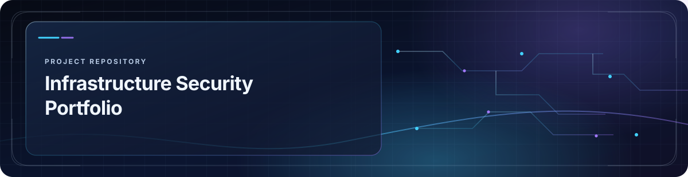

  

  

<a href="assets/readme-neon-visuals/signal-still.svg">View the motion-free signal artwork</a>

---

# Salah Ud Din Satti | Infrastructure Security Portfolio

This repository contains a single-page portfolio website (`index.html`) covering infrastructure security, networking, professional experience, skills, education, projects, and certifications.
