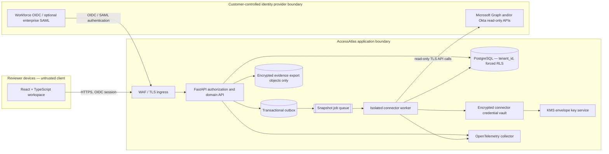
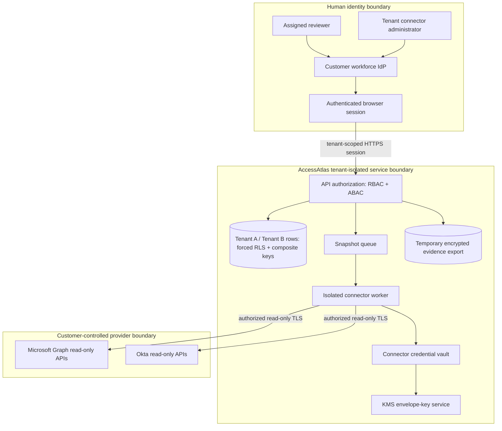

# AccessAtlas — Read-Only Identity Access Review Workspace


> **DESIGN PROPOSAL — NOT IMPLEMENTED**

>

> This is a portfolio concept aligned with the portfolio owner’s stated interests as a SOC Analyst and AI Enthusiast. It is a design exercise, not a claim that the owner built, deployed, operated, or measured this product. AccessAtlas is deliberately different from a SOC alert-triage copilot and from telemetry-health monitoring: its subject is identity access governance, reviewer judgment, and evidence continuity. It is not a scanner, vulnerability assessment, or automated remediation system.


## Audience, problem, and value


AccessAtlas is proposed for identity-governance teams, security operations partners, application owners, and auditors who need a legible way to review access across authorized identity sources. Reviews are often assembled from separate exports and spreadsheets. Account owners must reconcile inconsistent names and group labels, prioritize a large population, document why access should remain or receive follow-up, and later reconstruct who reviewed what. Fragmented snapshots and incomplete evidence make that work slow and difficult to audit.


The workspace would collect narrowly scoped, read-only snapshots, normalize a minimal set of identity and entitlement metadata, and present transparent review signals such as dormant accounts, unexpected role or privilege shifts, and incomplete review evidence. A signal is a prompt for a human, not proof of misuse. A named reviewer records a decision and rationale; an authorized owner handles any change outside AccessAtlas through their normal provider controls. The value proposition is a consistent review queue, traceable human decisions, and exportable evidence—not automated access enforcement.


The design draws on identity and security guidance such as [NIST SP 800-63-4 Digital Identity Guidelines (final, July 2025)](https://pages.nist.gov/800-63-4/), [NIST SP 800-53 Rev. 5, Release 5.2.0 (minor release; Aug. 27, 2025)](https://csrc.nist.gov/pubs/sp/800/53/r5/upd1/final), and the [voluntary CISA Cybersecurity Performance Goals 2.0](https://www.cisa.gov/cybersecurity-performance-goals-2-0-cpg-2-0). These are design references, not attestations, certification, or a claim of compliance.


### Package map

**Diagrams:** [architecture and data flow](diagrams/architecture.mmd) · [trust boundaries](diagrams/trust-boundaries.mmd). **Prototype:** [static synthetic-data mockup](prototype/index.html).

**Testing plan (proposed, not executed):** [evidence, backup, testing, and deployment](README.md#evidence-backup-testing-and-deployment). **Research context:** inline citations in [audience and value](README.md#audience-problem-and-value), [integrations](README.md#integrations-and-least-privilege), [tenant authorization](README.md#tenant-separation-schema-and-authorization), and [encryption/session controls](README.md#encryption-identity-and-session-controls).

## Assumptions and boundaries


The hypothetical customer has authority to read the source directory data it connects, an identity administrator to approve the grant, a designated review owner, and an internal policy defining review cadence and evidence retention. A tenant controls its provider registration, mappings, reviewer assignments, data residency choice, and deletion request. Snapshots are not necessarily complete or current; each view should display the source and collection time and avoid suggesting real-time accuracy.


AccessAtlas is strictly read-only toward connected identity providers. It never disables accounts, revokes sessions, changes group membership, provisions or deprovisions identities, or calls write-capable remediation APIs. No decision button can cause a provider-side change. There is no vulnerability scanning, endpoint telemetry monitoring, SOC alert queue, employee scoring, autonomous risk judgment, or AI-generated decision. A future text assistant, if separately considered, must not make access decisions; it is out of MVP scope. This proposal and its mockup are not implemented, backend-connected, production-ready, or evidence of deployment or measured outcomes. All names, companies, roles, IDs, events, and values shown are synthetic.


## People and use cases


**Review analyst** filters a campaign to their assigned population, examines the source timestamp and transparent reason a row was surfaced, and records “retain/reviewed” or “follow-up queued” with a rationale. “Follow-up queued” means a human-owned task in this workspace only; it does not alter access.


**Application owner** explains a business need, responds to a follow-up, and attaches or references evidence. **Identity administrator** authorizes a connector, verifies its read-only scopes, maps provider objects, and schedules snapshots. **Campaign manager** scopes a review, assigns reviewers, tracks completion, and exports a minimized evidence package. **Tenant security/privacy administrator** controls membership, retention, export, and deletion. **Independent auditor** receives time-bounded, read-only access to a specific review and its provenance, not broad tenant administration.


Representative use cases are quarterly access certification preparation, review of dormant accounts, role-change follow-up, reconciliation of unowned entitlements, and reconstruction of a completed campaign. Every signal exposes its rule version, input fields, thresholds, snapshot identifier, and collection timestamp so reviewers can challenge it.


## System architecture and stack


The browser application is **React + TypeScript**, with a design system that supports keyboard navigation, semantic tables, visible focus, and responsive review layouts. The API is **FastAPI/Python** with typed request models, generated OpenAPI, server-side authorization middleware, and domain services for campaigns, findings, decisions, and evidence. **PostgreSQL** is the system of record. Every tenant-owned row carries `tenant_id`; foreign keys and uniqueness constraints include it, and PostgreSQL **forced row-level security (RLS)** is applied to tenant tables. Application authorization and RLS are independent layers. Read-only provider snapshots are normalized into minimal metadata; the only object storage use is encrypted export evidence, not a shadow file archive.


A durable queue and worker pool perform connector snapshot jobs. A transactional outbox records a job request in the same PostgreSQL transaction as the schedule/campaign change, then a dispatcher publishes it. Workers use idempotency keys, bounded retries, and dead-letter handling. Connector credentials are stored separately from normalized records, envelope-encrypted with a cloud KMS and available only to the isolated connector worker identity. The worker fetches provider data over TLS, validates tenant/provider binding, maps fields, stores only allowlisted metadata, and emits a completion event. The API never returns credentials. OpenTelemetry traces, metrics, and structured logs link requests and jobs using opaque correlation IDs; tenant-sensitive values and tokens are excluded.


The service flow is shown below and in the standalone [service/data-flow diagram](diagrams/architecture.mmd); the separate [trust-boundary diagram](diagrams/trust-boundaries.mmd) shows tenant, provider, and user zones.





### Trust boundaries





Authentication for workforce users uses OIDC authorization code flow with PKCE; enterprise SAML 2.0 can be supported through a tenant-configured identity broker. The OIDC design follows [OpenID Connect Core 1.0 (incorporating errata set 2, 15 Dec 2023)](https://openid.net/specs/openid-connect-core-1_0.html). SAML support follows the [OASIS SAML 2.0 specification](https://docs.oasis-open.org/security/saml/v2.0/saml-core-2.0-os.pdf). Provider retrieval uses Microsoft Graph read-only application/delegated permissions or Okta Users, Groups, and System Log read scopes, selected to match tenant use cases and approved by an administrator. The [Microsoft Graph permissions reference](https://learn.microsoft.com/graph/permissions-reference) and [Okta OAuth 2.0 Scopes (Okta documentation)](https://developer.okta.com/docs/api/oauth2/) should be checked at connector design and approval time; product APIs and scopes evolve. For directory import, [SCIM 2.0 (RFC 7644)](https://www.rfc-editor.org/rfc/rfc7644) can be consumed as a read-only import interface where the provider permits it. No SCIM write operation is issued.


## Integrations and least privilege


Connectors are tenant-authorized, disabled by default, and provisioned only after a designated administrator sees the exact provider, requested permission set, objects, and purpose. Microsoft Graph should request the narrowest available read-only permissions for selected users, groups, membership, and directory audit data; do not grant broad write-capable directory permissions. An Okta connector requests only read access to required Users and Groups data and, where needed, System Log events. Minimize event access and query windows. If a provider cannot provide the approved read scope or a meaningful read-only credential, the connector is not enabled. Use dedicated service principals, short-lived OAuth tokens where supported, credential rotation, and separate credentials per tenant and environment. Tenant administrators can revoke authorization at the provider at any time. AccessAtlas never asks for a user's password and never stores provider access tokens in application tables.


API rate limits are honored with backoff and provider-specific concurrency caps. Partial collection is marked incomplete rather than silently presented as complete. Connector errors are visible to administrators; they do not create synthetic “clean” results. Webhooks, if added, are signature-verified, replay-window checked, deduplicated, and used only as a hint to schedule a fresh read-only snapshot. The system does not trust a webhook payload as an authorization decision.


## Tenant separation, schema, and authorization


A tenant is the security boundary. Tenant context comes from a validated authenticated membership, never from a caller-supplied header alone. After the server verifies membership, each request opens a transaction and sets the tenant context using a **bound SQL parameter**, for example `SELECT set_config('app.tenant_id', $1, true);`; the final `true` makes the setting transaction-local. Never interpolate a caller-provided tenant ID into SQL. Database policies deny access when context is absent or invalid. The application database role does not own tenant tables or have `BYPASSRLS`; policies are enabled and forced. Composite keys and relationships prevent cross-tenant joins even if a service query is defective. A simplified pattern is:


```sql

CREATE TABLE review_decision (

  tenant_id uuid NOT NULL,

  id uuid NOT NULL,

  finding_id uuid NOT NULL,

  reviewer_id uuid NOT NULL,

  outcome text NOT NULL CHECK (outcome IN ('retain', 'follow_up')),

  rationale text NOT NULL,

  created_at timestamptz NOT NULL DEFAULT now(),

  PRIMARY KEY (tenant_id, id),

  FOREIGN KEY (tenant_id, finding_id) REFERENCES finding (tenant_id, id)

);

ALTER TABLE review_decision ENABLE ROW LEVEL SECURITY;

ALTER TABLE review_decision FORCE ROW LEVEL SECURITY;

CREATE POLICY tenant_isolation ON review_decision

  USING (tenant_id = current_setting('app.tenant_id', true)::uuid)

  WITH CHECK (tenant_id = current_setting('app.tenant_id', true)::uuid);

```


Use separate database roles for migration, API, and worker; workers receive only the tenant-scoped access needed to store snapshots. Every object identifier in an API path is re-authorized against tenant and relationship. Role-based access control (RBAC) defines tenant admin, campaign manager, reviewer, application owner, and auditor capabilities. Attribute-based access control (ABAC) further limits reviewers to assigned campaigns and population, owners to their applications, and auditors to explicitly granted campaigns and expiry dates. Deny by default; check both object-level and function-level authorization as emphasized in the [OWASP Top 10 API Security Risks – 2023](https://owasp.org/API-Security/editions/2023/en/0x11-t10/). Use [OWASP Application Security Verification Standard (ASVS) v5.0.0](https://owasp.org/www-project-application-security-verification-standard/) as a design and verification reference, not as a claim of validation.


## Ingestion, processing, storage, and deletion


A scheduled or administrator-triggered job captures a point-in-time snapshot with provider, tenant, scope, retrieval window, pagination status, source timestamps, and connector version. The worker validates schema and tenant mapping, normalizes stable synthetic/provider object references into tenant-keyed records, and retains only the minimum fields needed for review: identity reference, display label, account state as reported, last-sign-in timestamp when authorized, group/role/entitlement reference and label, relevant change event metadata, and source provenance. Do not collect passwords, authentication secrets, message content, unrelated profile attributes, or raw full-directory dumps. A rule engine applies versioned, explainable rules; no machine-learning model is needed for MVP. Rule output is a finding with evidence pointers and explanation, not a verdict.


A proposed default is 13 months for normalized snapshots and decisions, configurable by tenant policy and applicable business needs; this is a design target, not a legal requirement. Raw provider responses are not retained by default. Export packages are generated on demand, encrypted in object storage, access-logged, and deleted after a short configurable window (proposed 30 days) or earlier when requested. On tenant offboarding, stop ingestion, revoke connector grants by prompting the customer administrator, delete tenant records and exports within a proposed 30-day operational target, and produce a deletion completion record that contains no deleted identity content. Backups age out under the backup schedule; backup deletion timing is disclosed and bounded. Legal holds, if ever supported, require explicit policy and an authorized owner.


## Encryption, identity, and session controls


Use TLS 1.2+ for service traffic (prefer TLS 1.3 where available), database/storage encryption at rest, and KMS envelope encryption for connector credentials and evidence objects. A per-tenant data-encryption key is wrapped by a KMS key; rotation rewraps data keys, and key access is limited to dedicated service identities. Separate production and non-production KMS keys and secrets. Never place credentials or personal data in logs, traces, URLs, analytics, or frontend bundles. This design is aligned with secure-by-default principles in [CISA Secure by Design](https://www.cisa.gov/securebydesign), but that reference is not an attestation.


Require workforce SSO through OIDC; permit enterprise SAML when configured. Require MFA through the organization's identity provider and, where risk permits, step-up authentication for connector approval, export, membership changes, and audit-log access. Validate issuer, audience, nonce, state, signature, and redirect URI. Sessions use Secure, HttpOnly, SameSite cookies, CSRF defenses, server-side revocation, idle timeout (proposed 30 minutes), and absolute lifetime (proposed 12 hours). Re-authenticate for sensitive exports and admin actions. Support SCIM only as inbound directory data, never as automated account lifecycle control.


## Audit, privacy, threats, and mitigations


Append-only audit events record authentication and authorization outcomes, connector consent and scope, snapshot start/completion, rule version, reviewer decision/rationale edits, campaign assignment, export access, retention/deletion events, and administrator configuration. Each event carries tenant, actor, timestamp, action, target reference, correlation ID, and before/after metadata where appropriate; avoid copying sensitive content. Protect event integrity with restricted write paths, immutable or tamper-evident archival, and routine access review. Reviewers can correct a decision only by creating a superseding event; no silent edit erases history. Privacy controls include data minimization, tenant-configured retention, export restrictions, data subject request workflow where applicable, and no cross-tenant analytics on identifiable data.


Threats include a tenant-context mix-up, insecure direct object reference, compromised reviewer account, malicious or overprivileged connector, stolen credential, poisoned or replayed webhook, provider API drift, queue duplication, evidence export exposure, insider misuse, and mistaken interpretation of stale data. Mitigations include composite foreign keys plus forced RLS; deny-by-default RBAC/ABAC and per-object authorization; phishing-resistant MFA where available, short sessions and revocation; read-only scopes and credential isolation; KMS-backed envelope encryption; signed, replay-protected webhook validation; schema allowlists and connector contract tests; idempotency and uniqueness constraints; expiring encrypted exports with audit; dual approval for high-impact administration; and source timestamps and partial-snapshot warnings. A residual risk is that source data or rules can be wrong: reviewer rationale and challenge paths remain essential. Incident response includes connector revocation guidance, tenant notification policy, credential rotation, scoped containment, evidence preservation, and post-incident review.


## API shape, jobs, and reliability targets


All API paths are versioned under `/v1`, require authenticated tenant membership, and return a request ID. Example conceptual request:


```http

GET /v1/campaigns/cmp_demo_01/findings?status=open&signal=dormant

Authorization: Bearer <workforce-session>

```


```json

{

  "items": [{

    "id": "fnd_demo_0042",

    "identity": {"id": "idn_demo_017", "display_name": "Mira Solis"},

    "signal": "dormant_account",

    "explanation": "No sign-in recorded in the configured 90-day window",

    "source_snapshot": "snp_demo_2025_04",

    "observed_at": "2025-04-12T09:30:00Z"

  }],

  "next_cursor": null

}

```


Identifiers above are synthetic; examples do not imply a live service. A reviewer decision is submitted to `POST /v1/campaigns/{campaign_id}/findings/{finding_id}/decisions` with `Idempotency-Key`, outcome `retain` or `follow_up`, and a rationale. The endpoint validates campaign assignment, finding/campaign/tenant consistency, role, and rationale length; it appends a decision event and creates an internal follow-up record if requested. It has no provider write path. Duplicate keys return the original result. `POST /v1/connectors/{id}/snapshots` enqueues an authorized read-only collection request, returning `202` and a job ID. Webhook callbacks are optional and only enqueue a refresh after validation.


Outbox rows are claimed with leases and dispatched at least once; consumers deduplicate by tenant/job/provider/snapshot key and use unique constraints so retries do not duplicate decisions or snapshots. Retries use capped exponential backoff with jitter. Poison jobs move to a dead-letter queue with restricted replay. Proposed SLOs for a future operated service are 99.9% monthly API availability, p95 under 500 ms for ordinary reads, p95 under 1 second for decision writes, and 95% of scheduled snapshots completed within 60 minutes when provider limits permit. These are proposed objectives, not measured results or promises; provider outage and throttling are reported separately.


## Evidence, backup, testing, and deployment


Evidence exports include campaign scope, snapshot/source timestamps, rule version, assigned population, decisions, rationales, and audit provenance. They exclude credentials and unrelated identity attributes. The export is clearly marked with generated time, tenant, classification, and completeness. Access is scoped, logged, encrypted, and temporary.


Proposed recovery objectives are RPO 15 minutes and RTO 4 hours for the application database, with encrypted daily backups, point-in-time recovery, cross-region copies only where tenant residency allows, and quarterly restore exercises. Export object storage has versioning and lifecycle deletion. Backups are isolated from normal credentials; recovery access is audited. These targets are planning assumptions, not achieved performance.


Testing includes unit tests for rules and normalization; property tests for pagination and idempotency; integration tests against provider simulators; authorization tests for every endpoint and object relationship; database tests proving forced RLS and composite foreign-key isolation across tenants; webhook signature/replay tests; accessibility checks; dependency and secret scanning in CI; load tests at designed scale; and recovery drills. Security verification should be mapped to relevant OWASP ASVS v5.0.0 controls, with unresolved findings tracked; no test result is implied here.


A hypothetical deployment uses separate development, staging, and production accounts, infrastructure as code, private database subnets, managed queue and KMS, containerized API/workers, signed builds, SBOMs, protected CI, reviewed migrations, and staged rollout with rollback. Secrets enter through a secret manager, never source control. Tenant-level feature flags and connector kill switches allow ingestion to be stopped without affecting review evidence. OpenTelemetry exports minimized traces and metrics to a tenant-isolated operations plane; alerts cover API errors, job lag, provider throttling, RLS failures, and export access anomalies. This proposal makes no claim of an actual deployment.


## MVP, later scope, and roadmap


**MVP proposal:** one tenant workspace with workforce OIDC; tenant roles and campaign assignments; one read-only provider connector (Microsoft Graph or Okta, selected after scope review); scheduled/manual snapshots; minimal normalized identities, groups, and entitlements; three transparent signals (dormant accounts, unexpected privilege/role shifts where source history allows, incomplete evidence); review decisions and rationale; audit trail; and temporary encrypted evidence export. Start with synthetic fixtures and provider sandbox environments. A review signal never blocks access or initiates provider-side action.


**Advanced, only after security review:** second connector, inbound SCIM import, policy-defined campaign templates, owner attestations, localization, delegated administration, privacy-preserving aggregate campaign metrics, customer-managed keys, regional data residency, signed evidence manifests, and retention/legal-hold workflows. AI assistance is not needed for the product proposition and would require separate data-use controls, explainability, and human validation before consideration.


Roadmap gates are: (1) validate reviewer workflows and threat model with synthetic data; (2) prototype tenant schema and authorization tests; (3) build a provider simulator and prove read-only scope behavior; (4) implement a limited pilot only with explicit customer authorization and independent security review; (5) assess operational readiness and deletion/recovery processes before any production claim. The static concept in this repository corresponds only to the first design/prototype stage.


## Hypothetical pricing and local preview


Illustrative SaaS pricing for discussion only: **Team** at $299/month for one tenant, up to 5,000 identities, 10 reviewers, and monthly evidence exports; **Business** at $899/month for up to 25,000 identities, 50 reviewers, and multiple campaigns; **Enterprise** custom pricing for larger populations, regional hosting, and customer-managed keys. These hypothetical tiers are not an offer, market validation, or actual product availability. Provider API quotas and retention needs would influence cost and limits.


Open `prototype/index.html` directly in a modern browser or serve the repository locally, for example `python3 -m http.server 8000` from the repository root, then visit `/projects/identity-governance/AccessAtlas/prototype/`. The prototype is a single static HTML file with inline CSS, SVG, and vanilla JavaScript: no backend, network calls, external libraries, authentication, or live provider integration. Search, filters, and decision controls work only in the current page's memory and reset on reload. Its sample data is synthetic. The mockup displays **STATIC INTERACTIVE MOCKUP • SYNTHETIC DATA ONLY** and **DESIGN PROPOSAL — NOT IMPLEMENTED**; nothing in it changes account access.


## Local synthetic-data MVP (added 2026-10-08)

This project now has a separate, runnable local MVP under [`mvp/`](mvp/). See the [MVP run guide](mvp/README.md), [`mvp/core.py`](mvp/core.py), and [`mvp/domain.py`](mvp/domain.py). The implementation uses only synthetic identity snapshots and local plaintext SQLite on one workstation; it has no login or tenant isolation. It is **not deployed SaaS** and has no provider connector, account provisioning, revocation, or write-back. The design proposal above and original static prototype remain separate and intact.
