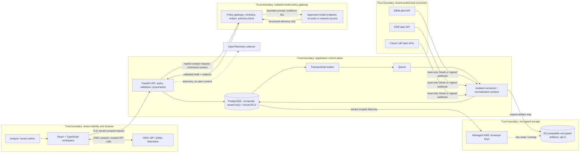
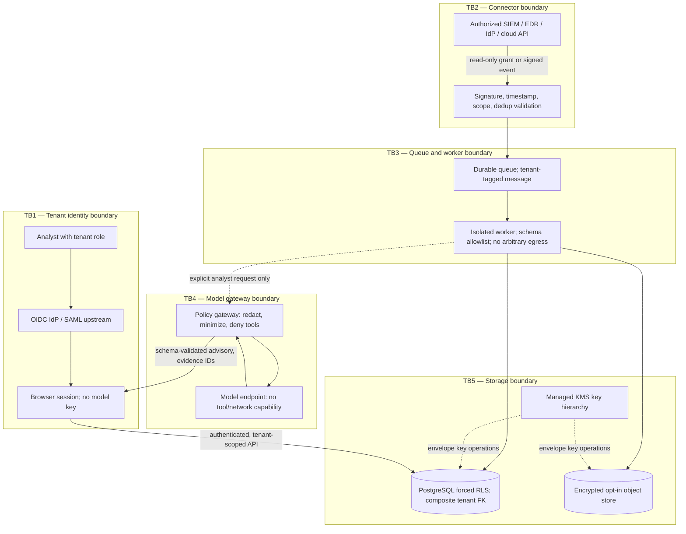

# TriageSignal — Evidence-First SOC Alert Triage


> **DESIGN PROPOSAL — NOT IMPLEMENTED**

>

> TriageSignal is a design concept for an analyst-facing, read-only alert-context triage workspace with advisory AI. It is documentation only: there is no service, backend, connector, model integration, deployment, or production readiness implied here. No real alerts, identities, organizations, or outcomes are represented. Links below are design references, not attestations.


## Audience, problem, and value


The intended audience is SOC analysts and security operations leads, particularly practitioners interested in responsible AI-assisted analysis. Alerts arrive with partial context across identity, endpoint, cloud, and SIEM records. Analysts spend time pivoting between authorized consoles, reconstructing a timeline, and recording why an alert deserves attention. Generic severity labels do not explain which evidence supports a conclusion, whether records conflict, or what is still unknown.


TriageSignal proposes one read-only workspace that groups an alert with time-bounded, source-attributed context; separates observed facts from generated interpretation; and offers a reviewable draft for a human to edit or reject. Its value proposition is faster, more consistent context gathering without replacing analyst judgment or changing the source systems. Any future evaluation of that proposition would require a separately approved pilot and measured, privacy-reviewed evidence; this concept makes no outcome claims.


### Package map

**Diagrams:** [service and data flow](diagrams/architecture.mmd) · [trust boundaries](diagrams/trust-boundaries.mmd). **Prototype:** [static synthetic-data mockup](prototype/index.html).

**Testing plan (proposed, not executed):** [reliability, operations, and quality](README.md#reliability-operations-and-quality). **Research context:** inline citations in [advisory AI and human review](README.md#advisory-ai-and-human-review), [identity and authorization](README.md#identity-authorization-and-session-lifecycle), and [privacy and audit](README.md#privacy-retention-encryption-and-audit).

### Assumptions and boundaries


The proposal assumes an organization already has authorization and vendor-supported APIs for the specific SIEM, EDR, identity provider (IdP), or cloud-security alert sources it chooses to connect. A tenant administrator explicitly selects sources, scopes, alert categories, retention, and permitted data fields. Where authorization or source attribution is unclear, no enrichment is requested and the interface says so.


**Out of scope:** scanning, vulnerability assessment, exploit development or execution, threat hunting beyond configured alert context, arbitrary internet lookups, endpoint commands, containment, account changes, ticket/case write-back, automatic prioritization that drives enforcement, and autonomous or consequential remediation. There is no real AI API call in this proposal or prototype. Recommendations are advisory only; a human must explicitly review and approve any case note before it could be accepted in a future system. This is not a second “Cybersecurity AI Scanner.”


## People and typical use


- **SOC analyst:** opens a selected alert, checks a normalized evidence timeline, compares original source details against linked context, and writes or rejects a human-reviewed note.

- **SOC lead:** defines triage queues and review expectations, checks provenance and audit events, and adjusts the tenant's retention and role policies.

- **Tenant administrator / security engineer:** authorizes an approved read-only connector, sets field and time-window limits, configures SSO and retention, and tests revocation and deletion.

- **Privacy or platform operator:** handles tenant-isolated support and deletion requests under approved access, with a recorded reason and time-limited elevation.


A typical analyst flow is: select an alert → inspect source facts and evidence links → review missing or conflicting context → request an optional minimized AI draft → compare every claim to cited evidence → edit, reject, or mark the draft reviewed → explicitly accept a note only after review. The concept includes no button that sends a response action to an endpoint, IdP, or cloud account.


## Proposed architecture and data path


The proposed UI is **React + TypeScript**; APIs and workers use **FastAPI/Python**. **PostgreSQL** stores tenant-scoped normalized records with composite tenant keys and forced row-level security (RLS). Explicitly configured, minimized artifacts may use **S3-compatible object storage** with managed **KMS envelope encryption**. A queue and worker process authorized ingestion asynchronously through a **transactional outbox**; **OpenTelemetry** carries service telemetry with identifiers and content minimized. Tenant authentication delegates to an OIDC identity provider; SAML federation may be supported through that IdP. The model is reached only through an isolated policy gateway, never directly from the browser or worker.


The API boundary validates tenant membership, object ownership, schema, time range, and authorization. Connectors use only vendor-supported alert/context APIs, with per-tenant credentials stored encrypted and revocable. Use the least-privilege **read-only OAuth/API grants** available; request alert read and only the minimum context scopes required. For inbound push, accept only signed webhooks configured by an authorized source, verify the raw-body signature before parsing, enforce timestamp tolerance, and deduplicate event identifiers. Polling is preferred where signed push is unavailable. Connector code must not expose arbitrary URL fetching or permit a user-supplied endpoint that could become SSRF.


Normalized facts retain source name, source record ID, source event time, ingestion time, field provenance, and a stable evidence ID. Raw payloads are minimized at ingestion and discarded unless a tenant explicitly configures a narrowly scoped artifact class and short retention. Normalized records use a tenant-selected retention window; a tenant administrator can export or delete tenant data, and connector revocation stops subsequent collection. Deletion covers database rows, object versions, queue items, caches, and backups according to a documented expiry process; backup copies age out on their stated schedule.


### Mermaid service and data-flow architecture


Standalone sources: [service/data flow](diagrams/architecture.mmd) and [trust boundaries](diagrams/trust-boundaries.mmd).





### Mermaid trust-boundary view





## Integration, API, and tenant isolation


A connector can be enabled only by a tenant administrator after verifying source ownership and vendor permissions. OAuth tokens are stored encrypted, never returned to the UI, rotated or revoked through a documented lifecycle, and scoped to read-only alert/context endpoints. The product would use HTTPS/TLS for API and webhook transport. Webhook HMAC verification, where a source offers a supported signing scheme, uses constant-time comparison over the raw request bytes, a bounded clock-skew window, and a unique event ID; persist the deduplication decision. Reject stale, duplicate, malformed, oversized, or incorrectly signed events. Never treat a webhook as authenticated merely because it reached the endpoint.


Example **illustrative** REST request (all identifiers and values are fictional):


```http

GET /v1/alerts/al_demo_1042/context?since=2025-02-18T09%3A00%3A00Z&limit=50 HTTP/1.1

Host: api.example.invalid

Authorization: Bearer <short-lived-session-token>

X-Request-ID: req_demo_72

Accept: application/json

```


Illustrative response:


```json

{

  "alert_id": "al_demo_1042",

  "tenant_id": "tn_demo_a",

  "source": {"name": "sample-siem", "record_id": "src_demo_88"},

  "observed_at": "2025-02-18T09:21:00Z",

  "facts": [

    {"evidence_id": "ev_demo_01", "kind": "identity_sign_in", "observed_at": "2025-02-18T09:18:00Z", "summary": "Synthetic sign-in context; region differs from prior sample", "source_record_id": "idp_demo_11"},

    {"evidence_id": "ev_demo_02", "kind": "endpoint_alert", "observed_at": "2025-02-18T09:21:00Z", "summary": "Synthetic endpoint alert linked by pseudonymous device key", "source_record_id": "edr_demo_07"}

  ],

  "advisory": null,

  "next_cursor": null

}

```


The tenant identifier in a request is not proof of authorization. Resolve membership from the authenticated principal server-side and derive tenant scope from that membership. Each tenant-owned table carries `tenant_id`; composite primary/foreign keys prevent cross-tenant joins. PostgreSQL RLS is **forced** even for table owners used by application roles, and the application role has no `BYPASSRLS` privilege. Set the tenant context transaction-locally after authorization, reset it on transaction completion, and fail closed if it is missing.


Illustrative schema and RLS pattern (migration code would additionally apply grants, indexes, and policies to every tenant table):


```sql

CREATE TABLE alert (

  tenant_id uuid NOT NULL,

  id uuid NOT NULL,

  source_key text NOT NULL,

  observed_at timestamptz NOT NULL,

  summary text NOT NULL,

  PRIMARY KEY (tenant_id, id),

  UNIQUE (tenant_id, source_key)

);

CREATE TABLE evidence (

  tenant_id uuid NOT NULL,

  id uuid NOT NULL,

  alert_id uuid NOT NULL,

  source_record_id text NOT NULL,

  observed_at timestamptz NOT NULL,

  fact jsonb NOT NULL,

  PRIMARY KEY (tenant_id, id),

  FOREIGN KEY (tenant_id, alert_id) REFERENCES alert (tenant_id, id)

);

ALTER TABLE alert ENABLE ROW LEVEL SECURITY;

ALTER TABLE alert FORCE ROW LEVEL SECURITY;

ALTER TABLE evidence ENABLE ROW LEVEL SECURITY;

ALTER TABLE evidence FORCE ROW LEVEL SECURITY;

CREATE POLICY alert_tenant_scope ON alert

  USING (tenant_id = current_setting('app.tenant_id', true)::uuid)

  WITH CHECK (tenant_id = current_setting('app.tenant_id', true)::uuid);

CREATE POLICY evidence_tenant_scope ON evidence

  USING (tenant_id = current_setting('app.tenant_id', true)::uuid)

  WITH CHECK (tenant_id = current_setting('app.tenant_id', true)::uuid);

-- After server-side membership verification, within every transaction:

SELECT set_config('app.tenant_id', :authorized_tenant_uuid, true);

```


Test the pattern with connection-pool reuse, absent/invalid tenant context, cross-tenant IDs, joins, exports, background jobs, and a non-owner role. RLS supplements—not replaces—application authorization and composite-key constraints.


## Advisory AI and human review


A future model call would occur only after an analyst explicitly requests a draft. The isolated policy gateway constructs a minimized, redacted context from approved fields, drops unrelated identifiers and secrets, and passes only evidence IDs plus short source-derived excerpts. It provides no tools, browser, shell, network access, or ability to mutate a case. Prompt-injection-like text in an alert is treated as untrusted quoted evidence, never as instructions. The response must conform to a strict versioned JSON schema, contain evidence IDs for each factual claim, and cite only IDs in the supplied context. The gateway rejects invalid output, unsupported IDs, or uncited factual claims; if evidence is insufficient, conflicting, or outside policy, it abstains with a reason rather than inventing an answer.


The interface visibly labels generated interpretation, shows source facts separately, and links each claim to a source record. Confidence language is not presented as calibrated probability. A human reviews and edits the draft; no case note is accepted until an explicit review/accept step, recorded with actor and timestamp. [NIST AI 600-1, Artificial Intelligence Risk Management Framework: Generative Artificial Intelligence Profile (July 2024)](https://nvlpubs.nist.gov/nistpubs/ai/NIST.AI.600-1.pdf) and [OWASP Top 10 for LLMs 2023-24](https://genai.owasp.org/llm-top-10/) inform proposed risk controls; neither is represented as an endorsement or attestation.


## Identity, authorization, and session lifecycle


OIDC Authorization Code flow with PKCE is the preferred sign-in path; SAML 2.0 federation may be delegated to the tenant's OIDC-capable identity broker. Require MFA through the IdP, with stronger step-up for connector changes, exports, and privileged administration. Validate issuer, audience, signature, nonce, state, redirect URI, and token time claims. Use short-lived server sessions with secure, HttpOnly, SameSite cookies; rotate session identifiers after sign-in and privilege changes; implement CSRF defenses for state-changing requests; idle and absolute expiry; logout/revocation; and reauthentication for high-risk actions. No bearer token, OAuth connector secret, or model key is stored in browser local storage.


RBAC grants analyst, lead, tenant administrator, and narrowly scoped support roles. ABAC conditions further restrict by tenant, case assignment, data classification, connector state, and action purpose. Support access is denied by default, requires tenant-approved time-bounded elevation and recorded reason, and is read-only. Separate duties for authorizing connectors, changing retention, and reviewing access. Enforce authorization at every API object and action boundary, not solely in the interface; these controls reflect risks highlighted by the [OWASP Top 10 API Security Risks – 2023](https://owasp.org/API-Security/editions/2023/en/0x11-t10/).


## Privacy, retention, encryption, and audit


Collect only alert fields necessary for the chosen triage workflow. Avoid storing full raw events, credentials, unrelated identity attributes, or payload attachments by default. Tenant-configured short retention applies separately to normalized alerts, evidence excerpts, generated drafts, audit records, and optional artifacts. Provide tenant-initiated export and deletion; validate export authorization and audit its completion. Logs omit alert bodies, tokens, personal identifiers where possible, and model prompts. OpenTelemetry traces carry opaque correlation IDs, not source content.


Use TLS in transit and provider-managed encryption at rest, with managed KMS envelope encryption for application data and explicitly configured object artifacts. Separate tenant data-encryption keys logically, wrap them with KMS-managed keys, restrict unwrap operations to workload identities, rotate keys on a stated schedule, and audit key use. Backups are encrypted and access controlled. A deletion workflow tombstones and removes primary data and object versions, purges derived indexes and queued jobs, records a content-free deletion event, then expires backup copies within the disclosed backup window.


Audit events are append-only from ordinary application roles and include tenant, actor, action, target type/opaque ID, authorization result, request/correlation ID, timestamp, and reason where relevant. Do not put evidence content or secrets in audit records. Tenant-visible audit export and retention configuration support accountability. The proposal is designed to support risk-management practices described by [NIST Cybersecurity Framework (CSF) 2.0](https://www.nist.gov/cyberframework), [NIST SP 800-61 Rev. 3](https://csrc.nist.gov/pubs/sp/800/61/r3/final) (final April 2025), and selected controls in [NIST SP 800-53 Rev. 5, Release 5.2.0 (minor release; Aug. 27, 2025)](https://csrc.nist.gov/pubs/sp/800/53/r5/upd1/final); it is not certified or compliant by virtue of this design. Verification could use [OWASP Application Security Verification Standard (ASVS) v5.0.0](https://owasp.org/www-project-application-security-verification-standard/) as a test-planning reference, not an attestation.


## Threat model and defenses


| Threat | Proposed mitigation |

|---|---|

| Cross-tenant object access or confused deputy | Server-derived tenant scope, RBAC/ABAC on every request, composite tenant FKs, forced RLS, tenant-context fail-closed, adversarial isolation tests. |

| Stolen connector token or overbroad grant | Least-privilege read-only scopes, KMS-backed secret storage, short access-token lifetime where supported, rotation/revocation, audit, no token in logs/UI. |

| Forged/replayed webhook or poisoned event | Vendor-supported signature validation over raw bytes, timestamp tolerance, constant-time compare, event dedupe, size/schema limits, quarantining malformed payloads. |

| Prompt injection, hallucination, or evidence fabrication | Treat source text as untrusted data, no model tools/network, minimized context, strict schema and citation allowlist, abstain on insufficient evidence, explicit human review. |

| SSRF, malicious attachments, queue poisoning | No arbitrary fetch URLs, allowlisted connector hosts, egress controls, content-type/size limits, isolated worker, authenticated queue, idempotent validation. |

| Account/session compromise | Federated MFA, PKCE, secure cookies, CSRF defenses, session rotation/expiry, step-up for export and administration, access revocation. |

| Sensitive data exposure or insider misuse | Data minimization, tenant retention/deletion controls, encrypted stores, least-privilege support, immutable audit trail, redacted telemetry, key-use monitoring. |

| Denial of service or duplicate processing | Per-tenant rate/concurrency limits, bounded retries with dead-letter handling, backpressure, payload caps, idempotency keys, alerting. |


These are design mitigations to validate, not claims that threats have been eliminated.


## Reliability, operations, and quality


Proposed operational targets for a future service—not measured results—are API availability of **99.5% monthly** for core read operations, p95 alert-context API latency **under 1 second** excluding upstream source latency, and accepted-connector ingestion freshness **under 5 minutes at p95** where the source API permits it. Show connector lag and partial-source failures transparently; never convert missing context into an assertion of safety. Retry transient failures with bounded exponential backoff and jitter; route repeated failures to a tenant-isolated dead-letter queue and surface operator-visible status.


Proposed backup objectives are **RPO ≤ 15 minutes** and **RTO ≤ 4 hours**, targets only and subject to architecture, cost, and restore testing. Encrypt backups, isolate backup credentials, test point-in-time restoration, and document retention and deletion caveats for backup copies. A future deployment would use separated development, staging, and production environments, infrastructure-as-code review, signed build artifacts, dependency and secret scanning, least-privilege workload identity, controlled migrations, rollback plans, and incident playbooks.


Testing includes unit and schema tests; connector contract fixtures containing synthetic data; webhook signature, replay, and dedupe tests; authorization matrix and cross-tenant RLS tests; session/CSRF tests; queue/outbox crash and retry tests; deletion/export lifecycle tests; model-gateway schema, citation, abstention, prompt-injection, and redaction tests with a mock model; accessibility and responsive UI checks; and load/failure exercises. No production data should be used in ordinary test fixtures. The release gate should include a human review of changes to scopes, data fields, model policy, and retention. NIST incident-response guidance in [SP 800-61 Rev. 3](https://csrc.nist.gov/pubs/sp/800/61/r3/final) is a design reference for integrating response preparation and learning—not an operational capability claim.


## MVP, later work, and hypothetical packaging


**MVP proposal:** single-tenant development environment; one documented, authorized read-only SIEM alert connector; normalized alert and evidence view; source/time provenance; tenant-scoped access model and isolation tests; a local synthetic-data dashboard; audit events; retention/export/delete design; and an optional mock-only AI advisory flow demonstrating schema validation, citations, abstention, and mandatory human review. A real model connection is not part of this portfolio concept.


**Later, gated extensions:** additional approved SIEM/EDR/IdP/cloud connectors; tenant SSO and fine-grained policies; analyst collaboration and case-note export after human acceptance; evaluated model gateway with privacy and safety review; configurable retention controls; and tenant-level operational reporting. Each extension requires separate authorization, threat review, privacy assessment, and testing. No write-back or automated remediation is proposed.


For planning discussion only, hypothetical SaaS packaging could be: **Sandbox** (free, synthetic/local only), **Team** (illustrative $49/analyst/month), and **Enterprise** (illustrative $149/analyst/month plus negotiated support). These are invented example prices, not a market benchmark, quote, offer, or validated business model. Any actual pricing would require research and commercial approval.


## Local preview and roadmap


The prototype at [`prototype/index.html`](prototype/index.html) is a standalone static interactive mockup with synthetic data, no network calls, no backend, and no real AI. To preview from the repository root, run `python3 -m http.server 8000 --bind 127.0.0.1` and open `http://127.0.0.1:8000/projects/security-operations/TriageSignal/prototype/`. Alternatively open the HTML file directly; browser clipboard permissions may differ under `file://`. The page has a link back to this proposal. It does not require npm, a build step, credentials, or external assets.


A responsible sequence would be: validate analyst workflow with synthetic scenarios; review data fields, connector scope, retention, threat model, and tenant boundaries with stakeholders; build and test an isolated read-only connector in a non-production environment; evaluate a policy gateway using mocked model responses and adversarial fixtures; conduct privacy/security review and recovery exercises; then consider a separately approved limited pilot. Each stage is conditional, and none has been performed by this concept.
