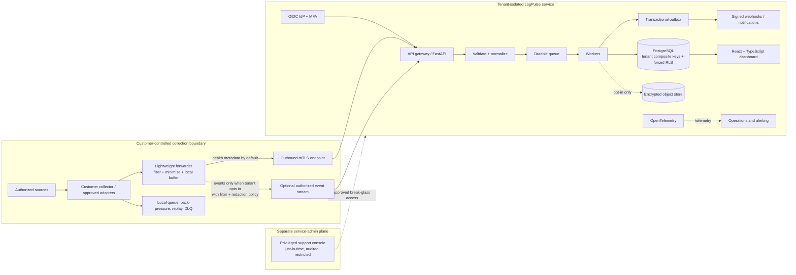
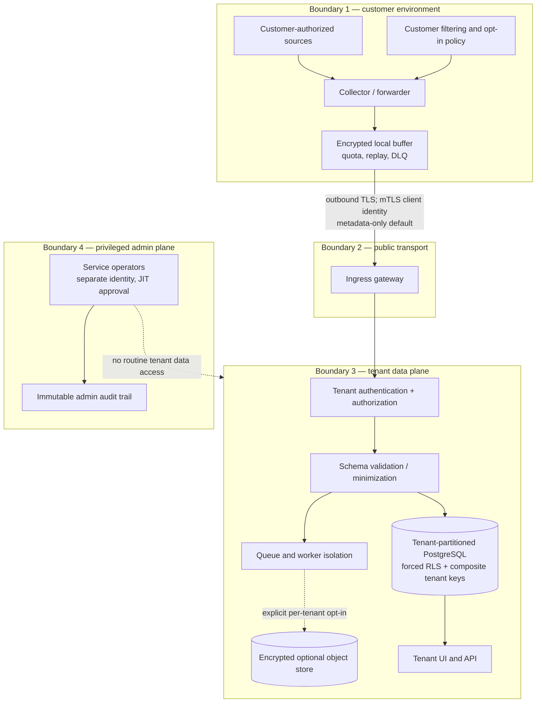

# LogPulse — Security Telemetry Health & Detection Readiness


> **DESIGN PROPOSAL — NOT IMPLEMENTED**

> LogPulse is a portfolio concept for security operations and responsible security tooling. This document describes a proposed design, not a deployed or backend-connected service. Any values and examples below are invented and synthetic.


## Who it is for, and what it solves


LogPulse is intended for SOC analysts, detection engineers, security platform owners, and IT or cloud operations teams at organizations that already have authorization to collect their own security telemetry. It addresses a quiet but important operational question: **is the telemetry a detection use case depends on arriving, remaining parseable, and mapped to the expected visibility?**


A source can be listed as “onboarded” while its forwarder is stale, its event count has collapsed, its parser has started rejecting records, or a field mapping has drifted. These conditions create blind spots that may only become apparent during an investigation. LogPulse proposes a source-centric health and evidence view: freshness and heartbeat, event-count windows, parser status, queue/backlog indicators, collector version, and a documented mapping between an approved source and a defensive visibility use case. It helps teams prioritize validation and ownership; it does not determine whether a detection is effective.


The value proposition is operational coordination rather than automated security action: one place to notice telemetry delivery or quality degradation, show the evidence and its time window, and route a human-owned follow-up to the responsible team. The concept is deliberately distinct from alert/case investigation and identity-access review products. It does not ingest or triage alert queues, create incident cases, assess users’ entitlements, or recommend identity changes.


Design choices are informed by CISA’s [Logging Reference Architecture (LRA)](https://www.cisa.gov/sites/default/files/2026-09/logging-reference-architecture-508.pdf), published in August 2026. The LRA discusses risk-based, source-appropriate collection; durable transport and buffering; normalization, validation, and protection; operational search; lower-cost retrievable retention; and controlled policy boundaries. It is a design reference, not an attestation or a claim that this proposal satisfies an agency requirement. The [CISA Best Practices for Event Logging and Threat Detection](https://www.cisa.gov/resources-tools/resources/best-practices-event-logging-and-threat-detection) likewise inform the emphasis on usable, source-appropriate event visibility.


### Package map

**Diagrams:** [source-to-health architecture](diagrams/architecture.mmd) · [trust boundaries](diagrams/trust-boundaries.mmd). **Prototype:** [static synthetic-data mockup](prototype/index.html).

**Testing plan (proposed, not executed):** [testing, deployment, and roadmap](README.md#testing-deployment-and-roadmap). **Research context:** inline citations in [design rationale](README.md#who-it-is-for-and-what-it-solves), [architecture and taxonomy](README.md#proposed-architecture-and-data-flow), and [security and privacy](README.md#security-tenancy-identity-and-privacy).

## Assumptions, boundaries, and personas


LogPulse assumes that a customer has authority over every source and collection path it configures, can identify source owners, and can define expected reporting cadence and relevant visibility questions. Those assumptions must be reviewed by the customer’s security, privacy, legal, and platform teams before any future implementation. The visual concept below uses fictional data only.


The product is **not** a scanner, vulnerability manager, penetration-testing or attack-simulation tool, response console, SIEM replacement, or detection-rule executor. It does not scan networks, probe endpoints, exploit systems, issue commands, change source configuration, or label an organization compliant. It reports observed delivery and mapping evidence against explicit customer-defined expectations; “ready” means only that a stated telemetry condition appears healthy for a stated time window. It is not a guarantee of detection coverage or security effectiveness.


Three primary personas shape the workflow. A SOC analyst wants to identify stale or degraded sources quickly and see why a visibility map is marked partial. A detection engineer wants to compare use-case expectations against source status, parser version, and required fields without confusing source presence with rule validation. A platform or source owner wants an actionable, timestamped handoff showing collector heartbeat, queue pressure, and parse errors without receiving unnecessary raw security events. A security administrator manages tenant membership, integrations, policy, and retention; a privacy reviewer checks which metadata or optional event content crosses the customer boundary.


Typical use cases are: review a tenant-level health summary; filter sources by owner, environment, or health; inspect freshness and parse status; document a planned maintenance window; compare an approved source mapping with a version-pinned visibility taxonomy; and export a small synthetic-safe status report. Human operators investigate and remediate source problems in their own authorized systems, outside LogPulse.


## Proposed architecture and data flow


The preferred design keeps detailed event records in the customer’s environment. A lightweight, customer-side forwarder emits **minimal health metadata**: opaque source ID, last-seen time, count window, parser status, backlog/heartbeat, forwarder version, and coverage mapping. It maintains a local durable buffer with bounded retention, checkpoint/replay, back-pressure, and an explicit dead-letter queue (DLQ). Queue saturation, rejected records, and DLQ accumulation become visible health states; the forwarder must never silently drop evidence. A customer can pause or remove a source locally. There is no remote command channel.


The cloud control plane is a tenant-isolated service: a React + TypeScript browser UI calls a FastAPI/Python API; PostgreSQL stores tenant-scoped configuration, health summaries, audit metadata, and derived status; workers normalize and validate submitted metadata; a durable queue absorbs bursts; and a transactional outbox publishes notifications only after the corresponding database transaction commits. An S3-compatible object store is available only if a tenant explicitly opts in to retention of permitted event payloads. The default is **no raw-event export and no raw-event object storage**. Identity uses an OIDC provider, while OpenTelemetry instruments service operations without capturing event contents or secrets.








Transport may include OTLP over HTTPS or gRPC and supported secure syslog/CEF into a customer-authorized collector. These are ingress options, not a license to discover or contact arbitrary systems. Configure endpoints allow-listed by tenant administrators, require authenticated TLS, and apply message-size, rate, schema, and tenant quotas. If an authorized customer explicitly enables event forwarding, that tenant must select source, purpose, fields, redaction, retention, and destination policy first; use mTLS, filtering, and redaction before data leaves its boundary. Event forwarding is disabled by default and per-tenant opt-in is separately auditable.


The flow follows the LRA’s general separation of source-appropriate collection, reliable transport, coordinated downstream handling, validation, operational access, and tiered retention, while keeping customer choice and policy boundaries explicit. It does not imply CISA endorsement. ATT&CK mapping is a **version-pinned knowledge taxonomy** for discussing which data subjects/components could contribute visibility. The [ATT&CK data sources reference](https://attack.mitre.org/datasources/) notes that data sources were deprecated in ATT&CK v18 (October 2025) and remain available for reference; LogPulse therefore labels the selected snapshot and migration status, and does not treat ATT&CK mapping as a compliance measure, proof of detection effectiveness, or pass/fail certification.


## Ingestion, processing, and storage lifecycle


1. **Enroll:** A tenant administrator creates a source record and assigns an owner, environment, expected cadence, permitted metadata fields, and optional mapping. Enrollment is declarative; it does not discover sources or install software remotely.

2. **Collect and buffer:** The customer-controlled forwarder produces a bounded health envelope. It batches and checkpoints locally, applies retry with jitter, observes back-pressure, and retains a DLQ entry for rejected batches until a configured local expiry or operator-reviewed replay. Health metadata must remain distinguishable from raw events.

3. **Authenticate and validate:** Ingress verifies the mTLS client certificate and tenant/source binding, request signature or token where applicable, schema version, timestamp bounds, content size, replay/idempotency key, and configured rate limits. Unknown fields are rejected or quarantined according to schema policy, not silently coerced.

4. **Normalize and process:** Workers normalize timestamps to UTC, validate count-window arithmetic and parser-state enums, attach schema and forwarder versions, calculate freshness against the tenant’s expected cadence, and derive an explainable health state. An idempotency key prevents retries from incrementing counts twice. Poison messages go to a monitored DLQ with a reason code and replay history.

5. **Persist and notify:** Tenant metadata and derived health are committed in PostgreSQL. Outbox entries are committed in the same transaction; asynchronous dispatch signs webhooks, applies bounded retries, and records delivery outcome without blocking ingestion. Webhook recipients use allow-lists, secret rotation, and replay protection.

6. **Expire or delete:** Default metadata retention is proposed at 90 days, configurable by tenant policy; audit records have a separately selected schedule, proposed default 365 days. Optional event payload retention is off by default and, if enabled, requires an explicit per-tenant schedule and cost estimate. Expiry jobs delete database partitions/rows and object versions, including documented backup expiry windows. Tenant offboarding blocks new ingestion, revokes credentials, deletes active records and object versions, and tracks backup expiration to completion. No deletion promise overrides a customer-selected legal hold; that hold must be explicit and bounded.


The optional encrypted object store is reserved for customers who explicitly need event retention; lifecycle tiers can move authorized payloads from a short searchable window to lower-cost retrieval, subject to the customer’s policy. Search access is separate from health dashboards and independently authorized.


## Security, tenancy, identity, and privacy


Every business row carries a `tenant_id`; relational keys and foreign keys include it, for example `PRIMARY KEY (tenant_id, source_id)` and `FOREIGN KEY (tenant_id, source_id) REFERENCES sources (tenant_id, source_id)`. PostgreSQL row-level security is enabled **and forced** on tenant tables. Application roles do not own tables or have `BYPASSRLS`; connection setup establishes tenant context from a verified identity, not a user-supplied header. Queries include the tenant key even with RLS, and background jobs carry an explicit tenant scope. Cross-tenant tests cover reads, updates, exports, search, queue payloads, object paths, and webhooks. Service administration uses a distinct plane and identity, just-in-time approval, time-limited access, and auditable break-glass procedures.


RBAC roles are Tenant Owner, Administrator, Analyst, Source Owner, Read-only Auditor, and Service Operator. ABAC conditions constrain actions by tenant, source ownership, environment, data classification, opt-in status, and approved purpose. Analysts can view health and mapping but cannot manage credentials; source owners see assigned sources; auditors receive read-only reports; and service operators have no default access to tenant event contents. Field-level authorization prevents sensitive optional payload properties from appearing in health APIs. These controls are designed to address common API risks such as object-level authorization, broken function-level authorization, resource exhaustion, and SSRF described in the [OWASP Top 10 API Security Risks – 2023](https://owasp.org/API-Security/editions/2023/en/0x11-t10/).


Users authenticate through OIDC authorization-code flow with PKCE; tenant policy requires MFA at the identity provider and supports SSO. Use short-lived, audience-bound access tokens, rotated refresh tokens, secure same-site cookies for browser sessions, CSRF protection where cookies authorize requests, session revocation on role change, idle and absolute session timeouts, and step-up authentication for sensitive administration. Forwarders use per-tenant/source mTLS identities that are scoped, rotated, revocable, and never reused as human credentials. Secrets are stored in a managed secret store, not in source code or UI configuration exports.


TLS 1.2+ is the transport baseline (prefer TLS 1.3 where supported). PostgreSQL volumes, backups, queues, and any opted-in object data use encryption at rest. KMS envelope encryption uses a tenant-scoped data-encryption key wrapped by a managed key; key rotation rewraps data keys, and access to key operations is role-separated and logged. A future high-assurance tier could use customer-managed keys; it is not part of the MVP. Minimize identifiers at collection, avoid message bodies and credentials, redact before optional forwarding, and prohibit secrets and personal data unless a separately reviewed use case expressly requires specific fields. UI exports are permission-checked, watermarked with tenant and export time, and audited.


Audit events record actor/service identity, tenant, action, target ID, outcome, timestamp, correlation ID, and policy version, but avoid raw payloads and secrets. The audit trail is append-only to the application, access-controlled, integrity-monitored, and retained on a separate schedule. Privacy notices explain metadata, optional content, processors, location, retention, deletion behavior, and support access. [NIST Cybersecurity Framework (CSF) 2.0](https://www.nist.gov/cyberframework) and [SP 800-61 Rev. 3](https://csrc.nist.gov/pubs/sp/800/61/r3/final) (final, April 2025) inform the risk-management and incident-response context for health evidence; neither is presented as a certification. CISA [CPG 2.0](https://www.cisa.gov/cybersecurity-performance-goals-2-0-cpg-2-0) is explicitly voluntary and informs prioritization only.


## API sketch, schema, queue, and webhooks


These illustrative endpoints are proposed contracts, not working APIs. All operations require authenticated tenant context and authorization; clients cannot select another tenant by altering a path or body field.


```http

POST /v1/telemetry/health

Authorization: Bearer <short-lived scoped token>

Idempotency-Key: src-9f2:win-2026-10-04T12:00Z:v3

Content-Type: application/json


{

  "source_id": "src-9f2",

  "window_start": "2026-10-04T12:00:00Z",

  "window_end": "2026-10-04T12:05:00Z",

  "event_count": 1842,

  "last_seen_at": "2026-10-04T12:04:51Z",

  "parser": {"status": "healthy", "version": "parser-3.4.1", "accepted": 1842, "rejected": 2},

  "backlog_count": 16,

  "heartbeat_at": "2026-10-04T12:04:55Z",

  "forwarder_version": "0.8.0",

  "coverage_refs": [{"taxonomy": "ATT&CK-data-sources", "snapshot": "customer-pinned", "ref": "DS0028"}]

}

```


The server derives tenant identity from the credential and checks that the source belongs to that tenant. The response returns an accepted receipt, schema version, server timestamp, and deduplication outcome; it does not disclose internal queue topology. A read endpoint such as `GET /v1/sources?health=degraded&cursor=...` returns only authorized fields and paginates with opaque, tenant-bound cursors. A proposed webhook contains a minimal changed-health summary, stable event ID, timestamp, tenant-scoped source ID, and signature; it omits raw records. Consumers verify HMAC/signature, timestamp tolerance, and event ID, then deduplicate. Retries are exponential with jitter; after the retry window, delivery is marked failed for human review, not treated as successful.


The conceptual schema includes `tenants`, `memberships`, `sources`, `health_windows`, `parser_versions`, `coverage_mappings`, `integration_credentials_metadata`, `webhook_subscriptions`, `audit_events`, and `outbox_events`. Every tenant-owned table includes `tenant_id` in unique constraints and joins; object keys are tenant-prefixed and opaque, but object naming alone is never the isolation control. Queue messages include tenant ID, source ID, schema version, idempotency key, expiry, and correlation ID; workers re-check tenant/source ownership before persisting. Outbox rows and health updates commit atomically. Replay has bounded attempts, operator-visible reason codes, and an audit record; duplicate delivery is safe by design.


## MVP, advanced capabilities, and measurement


The MVP proposal includes customer-managed source enrollment, metadata-only forwarder contract, freshness/count/heartbeat/parser/backlog health, configurable expected cadence, ownership and maintenance annotations, filtering and sorting, explicit evidence windows, version-pinned visibility mapping, tenant RBAC, audit trail, CSV/JSON status export, and webhook notification. The UI should explain why each state was derived and mark incomplete evidence as unknown rather than healthy. No automated remediation or detection execution is included.


Later, subject to privacy and threat review, advanced work could add multi-region tenant policy, customer-managed keys, schema-drift trends, integration-health adapters that consume read-only vendor status APIs, retention-cost estimates, customizable coverage catalogs, tenant-configurable service windows, and an optional isolated event-retention tier. Any AI assistance would be an opt-in summarization aid over approved metadata, carry provenance and uncertainty, have a human review point, and never issue a response command or substitute for telemetry. The CISA LRA discusses AI as an optional aid, not a substitute for required telemetry; this proposal does not require AI to deliver its core value.


Proposed operational objectives are **targets for a hypothetical future service, not measurements**: 99.9% monthly availability for the tenant dashboard/API; p95 health-metadata acceptance under 2 seconds at the documented supported load; 99% of valid metadata reflected in the dashboard within 60 seconds; and zero silent loss of acknowledged metadata within the stated durability boundary. These depend on region, customer connectivity, load, and maintenance and need load testing and a published support envelope before adoption. Availability exclusions, error budgets, status communication, and target definitions should be explicit. Customer-side offline buffering and replay remain essential because cloud availability cannot guarantee source delivery.


Proposed recovery objectives are an RPO of 15 minutes for tenant health/configuration metadata and RTO of 4 hours for core service restoration, with point-in-time database recovery and encrypted, access-separated backups. Optional object data uses versioned backups and documented lifecycle policy. Quarterly restore exercises, recovery evidence, and queue replay validation are proposed; targets are not claimed outcomes. A service status page would expose synthetic service-health summaries only, never customer telemetry.


## Threat model and mitigations


The design assumes threats from cross-tenant authorization mistakes, stolen forwarder credentials, malicious or malformed payloads, queue floods, replayed batches, compromised dependencies, insider misuse, webhook SSRF, accidental sensitive-data collection, and deletion gaps in replicas or backups. Tenant composite keys plus forced RLS, authorization at every object and function boundary, scoped mTLS credentials, rate and size limits, schema validation, idempotency, dependency scanning, signed builds, secret rotation, and audited access reduce these risks. Webhook destinations require HTTPS and allow-listed public hostnames/IP ranges, DNS resolution checks, redirect rejection, egress controls, and no cloud metadata/private-address routes to mitigate SSRF. Sensitive data is minimized and redacted before transmission; retention is explicit and tested. Operations monitor queue age, DLQ volume, certificate expiry, authorization denials, unusual export volume, and audit-pipeline failures. The approach is designed to support sound security practice; it does not eliminate risk or claim certification/compliance.


## Testing, deployment, and roadmap


Before a real build, validate threat assumptions with privacy and security reviewers and threat-model data flows. Automated testing should cover unit tests for freshness windows and parser transitions; contract tests for schema versions and idempotency; property-based malformed-input tests; tenant-isolation tests with adversarial cross-tenant IDs; authorization and field-level tests; queue outage, retry, poison-message, and replay tests; webhook signature and SSRF tests; deletion and backup-expiry checks; accessibility checks; dependency and container scans; and load, restore, and failure-injection exercises. Use only synthetic fixtures in development and demonstrations. No production data belongs in the mockup.


A future deployment would use isolated development, test, and production environments; infrastructure-as-code review; signed and pinned artifacts; protected secrets; staged database migrations; canary releases; rollback plans; least-privilege service identities; and a documented incident and support process. A phased roadmap is: (1) validate requirements, privacy and threat model, ownership and taxonomy lifecycle; (2) prototype metadata schema, forwarder buffering contract, and UI; (3) build tenant isolation, ingestion, audit, and failure handling; (4) pilot with an explicitly authorized synthetic or customer-approved source set; (5) review service objectives and retention evidence before any broader launch. The repository artifact itself is only a design document and local static mockup, not any of these implementation phases.


Hypothetical SaaS packaging for discussion only: **Starter** at $0 for up to 10 sources, metadata-only, 30-day health history; **Team** at $149 per month for up to 100 sources, 90-day history and webhooks; **Scale** from $599 per month for up to 500 sources with configurable retention and support response targets; and **Enterprise** custom pricing for private deployment options, customer-managed keys, and negotiated support. These invented tiers are not offers, tested unit economics, or commitments. Optional event retention would be separately metered and opt-in, with storage and egress estimates shown before enablement.


## Local preview and design references


Open `prototype/index.html` directly in a modern browser; no install, server, external network access, backend, CDN, or third-party asset is required. All displayed source names, counts, statuses, and timestamps are invented. Interactions only filter, sort, and reveal local synthetic details; they do not send data, change configuration, or represent a live connection. See the [standalone architecture diagrams](diagrams/architecture.mmd) for the source-to-health flow and trust boundaries.


The linked CISA, NIST, OWASP, and MITRE material is used as **design reference** for specific concepts described above, not as approval, implementation evidence, compliance evidence, or attestation. In particular, the MITRE ATT&CK data-source page is retained as a versioned defensive-visibility taxonomy reference and explicitly not an effectiveness measure.
